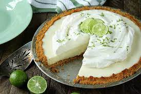

<html>
<head></head>
<body> 
<h1> The best key lime pie recipe</h1> 

Ive liked Key lime pie for a while now, so much so that I look up recipes for the desert so I can make the desert on my own. Key lime pie is a desert that i feel anyone   can like and, can make multiple servings of if needed to. This recipe is from <a href="https://www.foodnetwork.com/recipes/key-lime-pie-recipe1-2011840">FoodNetwork</a> as ive used the recipe for so long i feel the recipe should be shared with others,   especially for those who like key lime pie. 
 
<h2>Ingredients </h2>

 Graham Cracker Crust: <ul>
<li>1/3 of a 1-pound box graham crackers</li>  
<li>5 tablespoons melted unsalted butter</li> 
<li>1/3 cup sugar</li></ul>

Filling:

  <li>3 egg yolks   <li>2 teaspoons lime zest</li></li> 
<li>1(14-ounce) can sweetened condensed milk</li>  
 <li>2/3 cup freshly squeezed Key lime juice, or store bought</li>

Topping:
 <li>1 cup heavy or whipping cream chilled </li> 
<li>2 tablespoons confectioners' sugar</li>

<h3>Instructions</h3>

<ol><li> For the graham cracker crust: Preheat the oven to 350 degrees</li>

<li> Break up the graham crackers; place in a food processor and process to crumbs. If you don't have a food processor, place the crackers   in a large plastic bag; seal and then crush the crackers with a rolling pin. Add the melted butter and sugar and pulse or stir until combined.  Press the mixture into the bottom and side of a pie pan, forming a neat border around the edge. Bake the crust until set and golden, 8 minutes. Set aside on a wire rack; leave the oven on.</li>

<li>For the filling: Meanwhile, in an electric mixer with the wire whisk attachment, beat the egg yolks and  lime zest at high speed until very fluffy, about 5 minutes. Gradually add the condensed milk and continue to beat until thick,   3 or 4 minutes longer. Lower the mixer speed and slowly add the lime juice, mixing just until combined, no longer.  Pour the mixture into the crust. Bake for 10 minutes, or until the filling has just set. Cool on a wire rack, then refrigerate. Freeze for 15 to 20 minutes before serving.</li>

<li>For the topping: Whip the cream and the confectioners' sugar until nearly stiff.  Cut the pie into wedges and serve very cold, topping each wedge with a large dollop of whipped cream.</li>

<strong>Serve a Maximum of 3 slices per person </strong>

</body>
